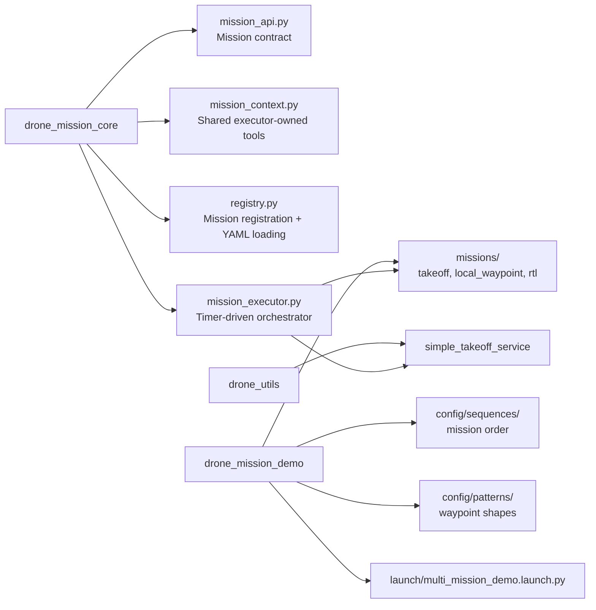
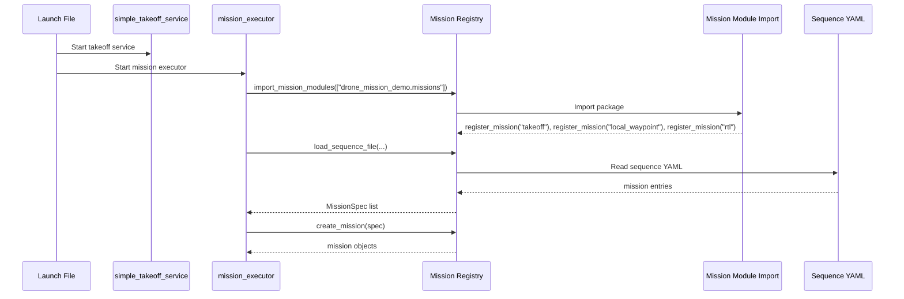
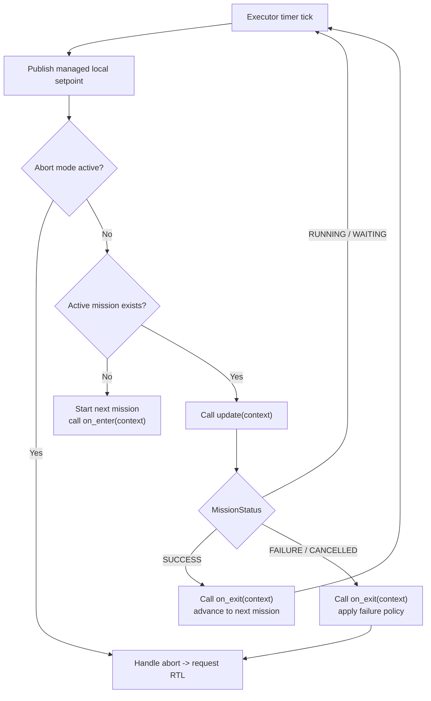
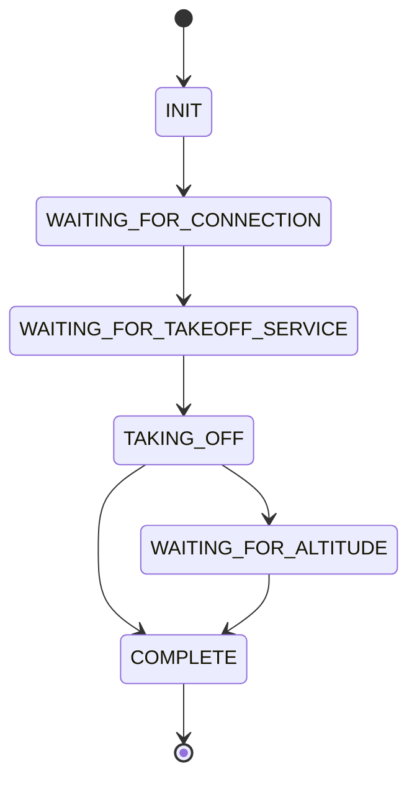
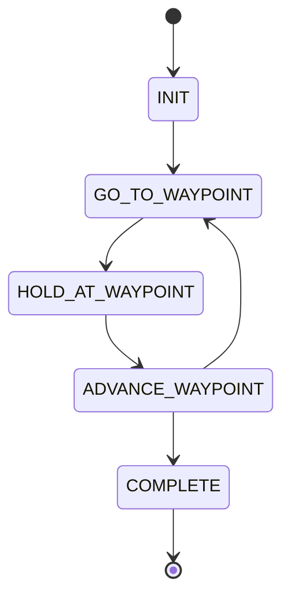
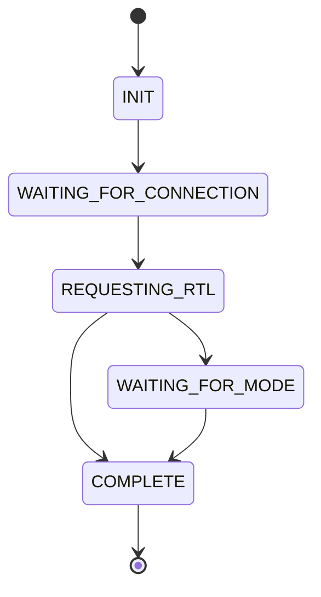

# Architecture

This document explains the new reusable multi-mission framework added to the workspace.

The framework was implemented in new packages only:
- [drone_mission_core](/Users/ppatel/Programming/CUASC_2026/src/drone_mission_core)
- [drone_mission_demo](/Users/ppatel/Programming/CUASC_2026/src/drone_mission_demo)

The existing mission packages were intentionally left unchanged.

## Goals

The new framework is meant to support:
- multiple missions in one flight
- no landing between intermediate missions unless a mission explicitly requires it
- reusable mission objects
- YAML-defined mission sequences
- ROS2-friendly non-blocking execution
- a structure that still feels similar to the existing timer/state-machine code in the repo

## Package Layout



## High-Level Runtime Model

There is exactly one executor node for the mission sequence.

That executor:
- owns shared subscriptions
- owns shared service clients
- owns the setpoint publisher
- holds the active mission object
- calls the active mission on every timer tick

Missions are plain Python objects. They are not standalone ROS nodes.

## Main Components

### 1. Mission API

Defined in [mission_api.py](/Users/ppatel/Programming/CUASC_2026/src/drone_mission_core/drone_mission_core/mission_api.py).

This file defines the common contract used by the executor and all missions.

Main types:
- `MissionStatus`
- `MissionFailurePolicy`
- `MissionSpec`
- `BaseMission`

Purpose:
- every mission exposes the same lifecycle
- every mission returns status in the same format
- every mission receives config in the same shape
- the executor can stay generic

### 2. Mission Context

Defined in [mission_context.py](/Users/ppatel/Programming/CUASC_2026/src/drone_mission_core/drone_mission_core/mission_context.py).

`MissionContext` is the executor-owned object passed into mission methods.

It gives missions access to:
- `mavros_state`
- `local_pose`
- `global_gps`
- `logger`
- `now()`
- `seconds_since(...)`
- `request_takeoff(...)`
- `request_mode_change(...)`
- `set_local_position_setpoint(...)`
- `clear_local_position_setpoint()`

It exists so missions do not each create their own ROS publishers, subscribers, or service clients.

### 3. Mission Registry

Defined in [registry.py](/Users/ppatel/Programming/CUASC_2026/src/drone_mission_core/drone_mission_core/registry.py).

Responsibilities:
- import mission modules
- register mission classes with `@register_mission(...)`
- load the sequence YAML
- convert YAML entries into `MissionSpec`
- create mission objects by mission type

### 4. Mission Executor

Defined in [mission_executor.py](/Users/ppatel/Programming/CUASC_2026/src/drone_mission_core/drone_mission_core/mission_executor.py).

Responsibilities:
- subscribe to MAVROS telemetry
- create the local setpoint publisher
- create shared service clients
- hold `MissionContext`
- load and instantiate the mission sequence
- start one mission at a time
- call `update(context)` every timer tick
- move to the next mission on `SUCCESS`
- abort to RTL on `FAILURE`

## Startup Flow



## Runtime Control Loop

Every timer tick, the executor does roughly this:

1. publish any managed setpoint
2. if failure handling is active, keep handling abort-to-RTL
3. if no active mission exists, start the next mission
4. otherwise call `active_mission.update(context)`
5. react to returned `MissionStatus`



## Example Sequence: Takeoff -> Square -> RTL

This is the simplest full path to understand the system.

Sequence file example:
- [square_only.yaml](/Users/ppatel/Programming/CUASC_2026/src/drone_mission_demo/config/sequences/square_only.yaml)

Pattern file:
- [square.yaml](/Users/ppatel/Programming/CUASC_2026/src/drone_mission_demo/config/patterns/square.yaml)

### Step 1: `TakeoffMission`

Defined in [takeoff_mission.py](/Users/ppatel/Programming/CUASC_2026/src/drone_mission_demo/drone_mission_demo/missions/takeoff_mission.py).

Its internal state machine is:



What happens:
- waits for MAVROS connection
- waits for `drone_utils/takeoff` service
- requests takeoff through `context.request_takeoff(...)`
- waits until local altitude reaches 90% of target
- returns `MissionStatus.SUCCESS`

### Step 2: `LocalWaypointMission`

Defined in [local_waypoint_mission.py](/Users/ppatel/Programming/CUASC_2026/src/drone_mission_demo/drone_mission_demo/missions/local_waypoint_mission.py).

Its internal state machine is:



What happens:
- loads the waypoint list from `pattern_file`
- converts each `[east, north]` point into `(east, north, altitude)`
- uses `context.set_local_position_setpoint(...)` to tell the executor where to fly
- checks arrival using current `context.local_pose`
- holds at each waypoint for `hold_time_s`
- repeats until all waypoints are done
- returns `MissionStatus.SUCCESS`

Important detail:
- the mission chooses the setpoint
- the executor continuously republishes that setpoint every timer tick

That is how setpoint ownership stays centralized while mission logic stays modular.

### Step 3: `RTLMission`

Defined in [rtl_mission.py](/Users/ppatel/Programming/CUASC_2026/src/drone_mission_demo/drone_mission_demo/missions/rtl_mission.py).

Its internal state machine is:



What happens:
- clears any old managed local setpoint
- waits for MAVROS connection
- requests `RTL` through `context.request_mode_change(...)`
- waits until FCU mode reports `RTL`
- returns `MissionStatus.SUCCESS`

## Sequence Networking: Who Talks To Whom

```mermaid
flowchart TD
    A["Sequence YAML"] --> B["MissionSpec"]
    B --> C["Mission Registry"]
    C --> D["Mission object"]

    E["mission_executor"] --> F["MissionContext"]
    E --> G["MAVROS subscriptions"]
    E --> H["Setpoint publisher"]
    E --> I["Takeoff client"]
    E --> J["Mode client"]

    D -->|update(context)| F
    F --> G
    F --> H
    F --> I
    F --> J

    D --> K["MissionStatus"]
    K --> E
```

This is the core dependency direction:
- config flows into mission specs
- mission specs create mission objects
- mission objects use `MissionContext`
- `MissionContext` is backed by executor-owned ROS resources
- missions return `MissionStatus` back to the executor

## Why This Structure Was Chosen

### Why not one ROS node per mission?

Because then each mission would want to own:
- setpoint publishers
- telemetry subscriptions
- mode/takeoff service clients

That becomes awkward when you want to chain missions in one flight. One executor owning shared flight control is simpler and safer.

### Why not ROS2 actions?

Because the current repo already uses:
- timer loops
- async services
- enum-based state machines

The new framework preserves that style instead of adding action-specific complexity before it is needed.

### Why each mission still has its own state machine

Because that matches the existing codebase and keeps complex missions readable.

For example, a future package drop mission can still look like:
- `ACQUIRE_TARGET`
- `CENTER_ON_TARGET`
- `DESCEND`
- `DROP_PAYLOAD`

The executor handles sequencing between missions, while each mission handles its own internal logic.

## Extension Path

The next likely extension is a future `PackageDropMission`.

That would probably require extending `MissionContext` with:
- global GPS setpoint support
- local velocity command support
- gimbal helper
- servo/actuator helper

But the outer architecture would remain the same:
- executor owns shared ROS resources
- mission object owns mission-specific state machine
- mission returns `MissionStatus`

## Relevant Files

Core:
- [mission_api.py](/Users/ppatel/Programming/CUASC_2026/src/drone_mission_core/drone_mission_core/mission_api.py)
- [mission_context.py](/Users/ppatel/Programming/CUASC_2026/src/drone_mission_core/drone_mission_core/mission_context.py)
- [registry.py](/Users/ppatel/Programming/CUASC_2026/src/drone_mission_core/drone_mission_core/registry.py)
- [mission_executor.py](/Users/ppatel/Programming/CUASC_2026/src/drone_mission_core/drone_mission_core/mission_executor.py)

Demo missions:
- [takeoff_mission.py](/Users/ppatel/Programming/CUASC_2026/src/drone_mission_demo/drone_mission_demo/missions/takeoff_mission.py)
- [local_waypoint_mission.py](/Users/ppatel/Programming/CUASC_2026/src/drone_mission_demo/drone_mission_demo/missions/local_waypoint_mission.py)
- [rtl_mission.py](/Users/ppatel/Programming/CUASC_2026/src/drone_mission_demo/drone_mission_demo/missions/rtl_mission.py)

Config:
- [multi_mission_demo.launch.py](/Users/ppatel/Programming/CUASC_2026/src/drone_mission_demo/launch/multi_mission_demo.launch.py)
- [square_only.yaml](/Users/ppatel/Programming/CUASC_2026/src/drone_mission_demo/config/sequences/square_only.yaml)
- [square_then_zig_zag.yaml](/Users/ppatel/Programming/CUASC_2026/src/drone_mission_demo/config/sequences/square_then_zig_zag.yaml)
- [square.yaml](/Users/ppatel/Programming/CUASC_2026/src/drone_mission_demo/config/patterns/square.yaml)
- [zig_zag.yaml](/Users/ppatel/Programming/CUASC_2026/src/drone_mission_demo/config/patterns/zig_zag.yaml)
