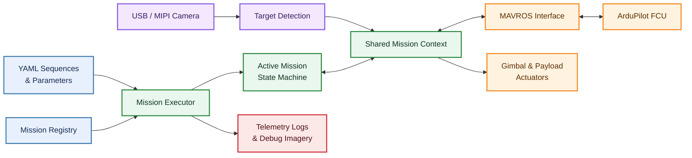

<div align="center">

# CUASC 2026 Autonomous Drone Platform

### Modular autonomy for perception-guided, multi-stage drone missions

[](https://docs.ros.org/en/humble/)
[](https://www.python.org/)
[](https://ardupilot.org/)
[](https://opencv.org/)
[](https://gazebosim.org/)

**[Overview](#overview) · [Architecture](#architecture) · [Mission Flow](#example-mission) · [Packages](#repository-layout) · [Setup](SETUP.md)**

</div>

---

## Overview

CUASC 2026 is a competition-oriented autonomous aerial robotics platform built with ROS 2, ArduPilot, MAVROS, and computer vision. It coordinates complete drone missions—from takeoff and waypoint navigation to visual target acquisition, payload delivery, relaunch, and return-to-launch—through a reusable mission framework designed for both simulation and real hardware.

The project’s central challenge is not making a drone perform one behavior in isolation. It is making perception, flight control, mission logic, and payload hardware work together reliably throughout a multi-stage flight.

> [!IMPORTANT]
> This repository is under active development. Flight code and hardware procedures should be validated in simulation and reviewed against the team’s preflight process before use on a real aircraft.

## Core Capabilities

| | Capability | What it enables |
|:---:|---|---|
| 🧭 | **Multi-mission autonomy** | Chains flight stages without unnecessary intermediate landings |
| ⚙️ | **YAML-defined behavior** | Changes mission order and tuning without modifying source code |
| 📍 | **Local and global navigation** | Flies ENU patterns and GPS waypoint routes through MAVROS |
| 👁️ | **Closed-loop computer vision** | Converts camera detections into resolution-independent alignment errors |
| 📦 | **Autonomous delivery** | Supports vision-guided drops and armed touch-and-go delivery with relaunch |
| 🛡️ | **Centralized flight control** | Prevents competing publishers from commanding the aircraft simultaneously |
| 📊 | **Simulation and observability** | Adds SITL workflows, mission logs, imagery, preflight checks, and focused live tests |

## Architecture



The system uses one timer-driven executor rather than one ROS node per mission. Missions are lightweight Python objects with a common lifecycle:

```text
on_enter(context) -> update(context) -> on_exit(context)
```

Each mission returns a status such as `RUNNING`, `SUCCESS`, or `FAILURE`. The executor advances the sequence, continuously republishes the active setpoint, and applies the configured failure policy—normally aborting the remaining sequence and requesting RTL.

This design keeps behavior modular while ensuring that only one component owns flight-control outputs at a time.

## Example Mission

A package-delivery flight moves through six coordinated stages:

```text
PRE-FLIGHT  →  TAKEOFF  →  GPS TRANSIT  →  VISUAL ALIGNMENT  →  DELIVERY  →  RELAUNCH & RTL
```

1. **Pre-flight:** establish telemetry and verify required MAVROS streams.
2. **Takeoff:** enter `GUIDED`, arm, and climb to the configured altitude.
3. **Transit:** fly through GPS waypoints to the delivery area.
4. **Alignment:** acquire the ground target and correct horizontal error while descending.
5. **Delivery:** commit to a fixed final column, confirm touchdown, and release the payload.
6. **Recovery:** remain armed, relaunch to a safe altitude, continue the sequence, and RTL.

The same executor can instead run local waypoint patterns, circuit time trials, package drops, or isolated hardware-test missions by selecting a different YAML sequence.

## Repository Layout

| Package | Layer | Responsibility |
|---|:---:|---|
| [`drone_mission_core`](src/drone_mission_core) | **Framework** | Mission lifecycle API, dynamic registry, YAML loader, shared ROS interfaces, and executor |
| [`drone_mission_demo`](src/drone_mission_demo) | **Behavior** | Takeoff, local/GPS waypoint, package-drop, package-delivery, and RTL missions |
| [`drone_target_cv`](src/drone_target_cv) | **Perception** | USB/MIPI image capture and red-target detection for closed-loop alignment |
| [`drone_utils`](src/drone_utils) | **Services** | Takeoff orchestration, stream setup, gimbal control, logging, and simulation helpers |
| [`drone_live_tests`](src/drone_live_tests) | **Validation** | Focused real-aircraft tests that isolate high-risk flight behaviors |
| [`vision_pipeline`](src/vision_pipeline) | **Research** | Image inference, geolocation, clustering, and offline photogrammetry experiments |

More detailed design documentation is available in [`Architecture.md`](Architecture.md). Package-level READMEs describe the interfaces and configuration for each subsystem.

## Engineering Highlights

### Reusable mission composition

Mission classes separate behavior from infrastructure. A registry discovers mission types, while YAML controls their order and per-flight configuration. The same `LocalWaypointMission`, for example, can fly a square or zig-zag pattern without duplicating control code.

### Non-blocking control

Flight behaviors are explicit state machines driven by ROS timers and asynchronous service calls. The executor remains responsive to telemetry and can enforce failure behavior while a mission is in progress.

### Simulation-to-hardware path

The software targets Gazebo/ArduPilot SITL as well as a Jetson-connected flight controller. Camera sources and launch configurations can be swapped without changing the mission API, and hardware preflight scripts verify that required MAVROS telemetry is available before flight.

### Safety and observability

The framework supports abort-and-RTL policies, bounded target-loss recovery, touchdown confirmation from flight-controller state, configurable fake payload releases, timestamped command/image logs, and standalone live tests for high-risk transitions.

## Technology Stack

| Autonomy | Flight | Perception | Development |
|---|---|---|---|
| Python | ArduPilot | OpenCV | Gazebo Harmonic |
| ROS 2 Humble | MAVROS / MAVLink | NumPy | ArduPilot SITL |
| YAML mission configs | Pixhawk-class FCU | USB / MIPI cameras | Jetson deployment |

## Getting Started

The full environment instructions have been moved to [`SETUP.md`](SETUP.md). Jetson-specific configuration is documented in [`JETSON_SETUP.md`](JETSON_SETUP.md).

After installing the required ROS 2, MAVROS, Gazebo, and ArduPilot dependencies:

```bash
colcon build
source install/setup.bash
ros2 launch drone_mission_demo multi_mission_demo.launch.py
```

Run a specific sequence by overriding the launch argument:

```bash
ros2 launch drone_mission_demo multi_mission_demo.launch.py \
  sequence:=config/sequences/square_only.yaml
```

Real-aircraft operation requires the appropriate vehicle configuration, mission parameters, and preflight telemetry checks; see the setup and package-specific documentation before attempting a live run.

## Extending the Platform

New behaviors can be added without changing the executor:

1. Subclass `BaseMission`.
2. Register the class with `@register_mission("mission_type")`.
3. Implement its non-blocking lifecycle methods.
4. Add the module and mission configuration to a sequence YAML file.

The result is a flight stack where new mission logic remains isolated, testable, and composable with existing behaviors.

---

<div align="center">

Built for autonomous flight, reusable robotics software, and reliable field iteration.

</div>
